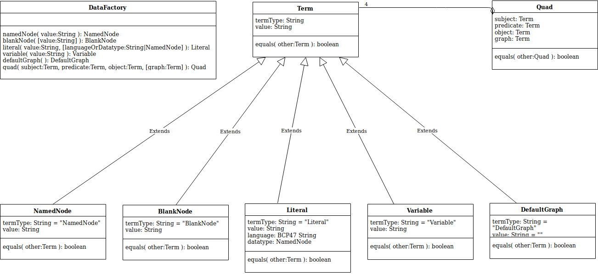

# Interface Specification: RDF Representation

## Mission Statement
This document provides a specification of a low level interface definition representing RDF data independent of a serialized format in a JavaScript environment. The task force which defines this interface was formed by RDF JavaScript library developers with the wish to make existing and future libraries interoperable. This definition strives to provide the minimal necessary interface to enable interoperability of libraries such as serializers, parsers and higher level accessors and manipulators.

**Status:** This document is a _draft_. 
**Purpose:** This document proposes a uniform interface to represent RDF data in low-level JavaScript libraries.

## Design elements and principles
- We define data interfaces to represent **triples**, **quads**, **named nodes**, **blank nodes**, **literals** and **variables**.
- Instances of the interfaces created with different libraries should be interoperable.
- Interfaces do _not_ specify how instances are stored in memory.
- Interfaces mandate specific pre-defined methods such as `.equals()`.
- Given the necessity of methods, plain objects (JSON) cannot be used.
- Factory functions (e.g., `quad()`) or methods (e.g., `store.createQuad()`) create instances.
  - Should allow "upgrading" a plain object into a fully functional triple
- Interfaces may have additional implementation specific properties.
  A list of these properties maintained on the [RDFJS Representation Task Force wiki](https://github.com/rdfjs/representation-task-force/wiki/Additional-properties).

## Data interfaces

### Term

Abstract interface.

**Properties:**
- `string .termType` contains a value that identifies the concrete interface of the term, since Term itself is not directly instantiated.
  Possible values include `"NamedNode"`, `"BlankNode"`, `"Literal"`, `"Variable"` and `"DefaultGraph"`.
- `string .value` is refined by each interface which extends Term

**Methods:**

- `boolean .equals(Term other)` returns `true` if and only if `other` has the same `termType` and the same contents (as defined by concrete subclasses).

### NamedNode extends Term

**Properties:**

- `string .termType` contains the constant `"NamedNode"`.
- `string .value` the IRI of the named node (example: `http://example.org/resource`)

**Methods:**

- `boolean .equals(Term other)` returns `true` if and only if `other` has `termType` `"NamedNode"` and the same `value`.

### BlankNode extends Term

**Properties:**

- `string .termType` contains the constant `"BlankNode"`.
- `string .value` blank node name as a string, without any serialization specific prefixes, e.g. when parsing, if the data was sourced from Turtle, remove _:, if it was sourced from RDF/XML, do not change the blank node name (example: `blank3`)

**Methods:**

- `boolean .equals(Term other)` returns `true` if and only if `other` has `termType` `"BlankNode"` and the same `value`.

### Literal extends Term

**Properties:**

- `string .termType` contains the constant `"Literal"`.
- `string .value` the text value, unescaped, without language or type (example: `Brad Pitt`)
- `string .language` the language as lowercase [BCP47](http://tools.ietf.org/html/bcp47) string (examples: `en`, `en-gb`) or an empty string if the literal has no language.
- `NamedNode .datatype` a NamedNode whose IRI represents the datatype of the literal

If the literal has a language, its datatype has the IRI `http://www.w3.org/1999/02/22-rdf-syntax-ns#langString`.
Otherwise, if no datatype is explicitly specified, the datatype has the IRI `http://www.w3.org/2001/XMLSchema#string`.

**Methods:**

- `boolean .equals(Term other)` returns `true` if and only if `other` has `termType` `"Literal"` and the same `value`, `language`, and `datatype`.

### Variable extends Term

**Properties:**

- `string .termType` contains the constant `"Variable"`.
- `string .value` the name of the variable without leading `?` (example: `a`)

**Methods:**

- `boolean .equals(Term other)` returns `true` if and only if `other` has `termType` `"Variable"` and the same `value`.

### DefaultGraph extends Term

An instance of `DefaultGraph` represents the default graph.
It's only allowed to assign a `DefaultGraph` to the `.graph` property of a `Quad`.

**Properties:**

- `string .termType` contains the constant `"DefaultGraph"`.
- `string .value` contains an empty string as constant value.

**Methods:**

- `boolean .equals(Term other)` returns `true` if and only if `other` has `termType` `"DefaultGraph"`.

### Triple

Triple is an alias of Quad.

### Quad

**Properties:**

- `Term .subject` the subject, which is a NamedNode, BlankNode or Variable.
- `Term .predicate` the predicate, which is a NamedNode or Variable.
- `Term .object` the object, which is a NamedNode, Literal, BlankNode or Variable.
- `Term .graph` the named graph, which is a DefaultGraph, NamedNode, BlankNode or Variable.

**Methods:**

- `boolean .equals(Quad other)` returns true if and only if the argument is a) of the same type b) has all components equal

### DataFactory

For default values of the instance properties and valid values requirements,
see the individual [interface definitions](#data-interfaces)

**Methods:**

- `NamedNode .namedNode(string value)` returns a new instance of NamedNode.
- `BlankNode .blankNode([string value])` returns a new instance of BlankNode.
  If the value parameter is undefined a new identifier for the blank node is generated for each call.
- `Literal .literal(string value, [string|NamedNode languageOrDatatype])` returns a new
  instance of Literal. If languageOrDatatype is a NamedNode, then it is used for the value of `.datatype`.
  Otherwise languageOrDatatype is used for the value of `.language`.
- `Variable .variable(string value)` returns a new instance of Variable. This method is optional.
- `DefaultGraph .defaultGraph()` returns an instance of DefaultGraph.
- `Quad .triple(Term subject, Term predicate, Term object)` returns a new instance of Quad with `.graph` set to DefaultGraph.
- `Quad .quad(Term subject, Term predicate, Term object, [Term graph])` returns a new instance of Quad.

## Stream interfaces

Streams are used only in a readable manner.
This requires only a single queue per stream, which simplifies implementations and doesn't have performance drawbacks, compared to writeable streams.

### Stream extends EventEmitter

**Methods:**

- `Quad .read()`
  This method pulls a quad out of the internal buffer and returns it.
  If there is no quad available, then it will return null.

**Events:**

- `readable()`
  When a quad can be read from the stream, it will emit this event.

- `end()`
  This event fires when there will be no more quads to read.

- `error(Error error)`
  This event fires if any error occurs.
  The `message` describes the error.

- `data(Quad quad)`
  This event is emitted for every quad that can be read from the stream.
  The `quad` is the content of the data.

**_Optional_ Events:**
These events are not required, but if an implementation wishes to support such events, they should conform to these definitions:

- `prefix(string prefix, NamedNode iri)`
  This event is emitted every time a prefix is mapped to some IRI.

### Source

A Source is an object that emits quads.
It can contain quads but also generate them on the fly.
For example, parsers and transformations which generate quads can implement the Source interface.

- `Stream .match([Term|RegExp subject], [Term|RegExp predicate], [Term|RegExp object], [Term|RegExp graph])`
  Returns a stream that processes all quads matching the pattern.

### Sink

A Sink is an object that consumes data from different kinds of streams.
It can store the content of the stream or do some further processing.
For example parsers, serializers, transformations and stores can implement the Sink interface.

- `EventEmitter .import(Stream stream)`
  Consumes the given stream.
  The `end` and `error` events are used like described in the `Stream` interface.
  Depending on the use case, subtypes of `EventEmitter` or `Stream` are used.

  Typical use cases:

  **Parser:** `Stream<Quad> .import(Stream stream)`

  **Serializer:** `Stream .import(Stream<Quad> stream)`

  **Transformation:** `Stream<Quad> .import(Stream<Quad> stream)`

  **Store:** `EventEmitter .import(Stream<Quad> stream)`

### Store extends Source, Sink

A Store is an object that usually used to persist quads.
The interface allows removing quads, beside read and write access.
The quads can be stored locally or remotely.
Access to stores LDP or SPARQL endpoints can be implemented with a Store inteface.

- `EventEmitter .remove(Stream stream)`
  Removes all streamed quads.
  The `end` and `error` events are used like described in the `Stream` interface.

- `EventEmitter .removeMatches([Term|RegExp subject], [Term|RegExp predicate], [Term|RegExp object], [Term|RegExp graph])`
  All quads matching the pattern will be removed.
  The `end` and `error` events are used like described in the `Stream` interface.
